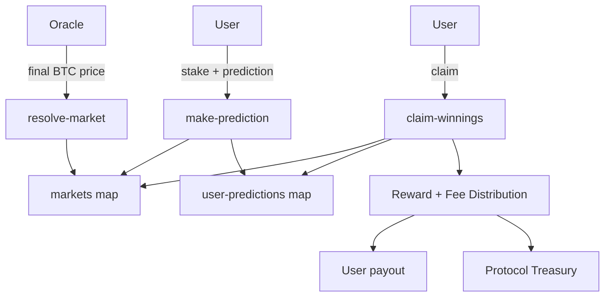

# OraclePulse - Bitcoin Price Prediction Protocol

## Overview

**OraclePulse** is a decentralized prediction market protocol built on the **Stacks blockchain**, enabling **trustless speculation on Bitcoin price movements**. It introduces a liquid, fair, and transparent environment where users stake STX to predict Bitcoin’s price direction within defined time horizons.

The protocol leverages **oracle-driven price feeds**, **automated settlement mechanisms**, and **dynamic reward distribution** to deliver a secure and efficient prediction market experience directly secured by Bitcoin.

---

## Key Features

* **Liquid prediction markets** – Support for customizable time horizons and multiple open markets.
* **Trustless settlement** – Markets resolved using verified Bitcoin price oracles.
* **Dynamic rewards** – Proportional distribution of winnings based on accuracy and stake size.
* **Protocol sustainability** – Configurable fee structure with treasury management.
* **Transparent governance** – Owner-controlled oracle updates, fee adjustments, and market rules.

---

## System Overview

At its core, OraclePulse operates as a **non-custodial smart contract** where:

1. **Users** stake STX to predict whether Bitcoin’s price will move **up** or **down** between market start and end.
2. **Oracles** supply the final settlement price of Bitcoin at market closure.
3. **Protocol logic** distributes winnings proportionally among correct predictors, deducting a small protocol fee.
4. **Treasury** accumulates fees to support protocol sustainability and governance actions.

---

## Contract Architecture

### Core Components

* **Markets (`markets` map)**
  Stores all market state including start/end price, total stakes, and resolution status.

* **User Predictions (`user-predictions` map)**
  Tracks individual user stakes, direction prediction (`"up"` or `"down"`), and claim status.

* **Governance Variables**

  * `oracle-address`: Authorized oracle principal for settlement.
  * `minimum-stake`: Minimum participation amount (in microSTX).
  * `fee-percentage`: Configurable fee charged on winnings.

---

### Contract Functions

#### Public Functions

* `create-market(start-price, start-block, end-block)`
  Create a new prediction market (owner-only).

* `make-prediction(market-id, prediction, stake)`
  Stake STX and record market direction prediction.

* `resolve-market(market-id, end-price)`
  Resolve a market with final oracle price (oracle-only).

* `claim-winnings(market-id)`
  Claim proportional winnings after resolution.

#### Read-Only Functions

* `get-market(market-id)` – Fetch market details.
* `get-user-prediction(market-id, user)` – Fetch user’s prediction for a market.
* `get-contract-balance()` – View treasury balance.

#### Governance Functions

* `set-oracle-address(new-address)` – Update oracle.
* `set-minimum-stake(new-minimum)` – Update stake requirement.
* `set-fee-percentage(new-fee)` – Adjust fee (0–100%).
* `withdraw-fees(amount)` – Owner withdraws protocol treasury.

---

## Data Flow (High-Level)



---

## Example Workflow

1. **Market Creation** – Owner creates a new market for BTC/USD between block X and block Y.
2. **Predictions** – Users submit `"up"` or `"down"` predictions with STX stakes before market closes.
3. **Resolution** – After block Y, the oracle submits the final BTC price.
4. **Claims** – Winning users proportionally share the total stake pool (minus protocol fee).
5. **Governance** – Owner can adjust parameters or withdraw fees for protocol growth.

---

## Installation & Usage

### Requirements

* Stacks CLI (`clarinet`) for local testing.
* Stacks mainnet/testnet deployment environment.

### Testing Locally

```bash
clarinet check
clarinet console
```

### Deployment

Update the `oracle-address` and `CONTRACT-OWNER` in the contract before deploying.

---

## Future Extensions

* Multi-outcome markets (beyond up/down).
* DAO-based governance for oracle selection and fee adjustments.
* Support for multiple asset oracles beyond BTC.
* Layered liquidity incentives for deeper markets.
